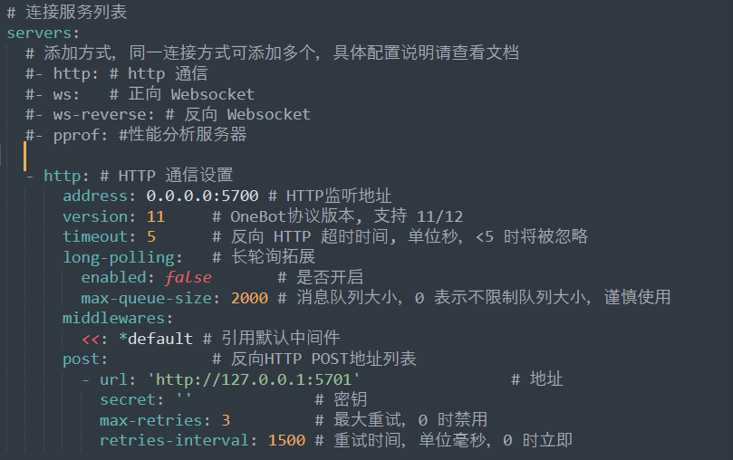

<p align="center">
  <a href="https://github.com/certainstar/little-Python-software/tree/%E7%89%88%E6%9C%AC%E6%9B%B4%E6%96%B0/%E7%9B%91%E5%90%AC%E8%84%9A%E6%9C%AC%E5%8F%AF%E6%89%A7%E8%A1%8C%E6%96%87%E4%BB%B6(.exe)">
    
  </a>
</p>

<div align="center">

# 监听脚本

_基于 [Mirai](https://github.com/mamoe/mirai) , [MiraiGo](https://github.com/Mrs4s/MiraiGo) 的 [OneBot](https://github.com/howmanybots/onebot/blob/master/README.md) Go语言(易语言)实现的框架,部分java代码实现的签名服务器_

_主要框架为来自[Mrs4s大佬的go-cqhttp机器人框架](https://github.com/Mrs4s/go-cqhttp/)_

_签名服务器为来自[fuqiuluo大佬的服务器部署](https://github.com/fuqiuluo/unidbg-fetch-qsign)_

_脚本程序为Python语言编写,可在仓库中找到[各个版本的Python源代码](https://github.com/certainstar/little-Python-software/tree/%E7%89%88%E6%9C%AC%E6%9B%B4%E6%96%B0/%E7%9B%91%E5%90%AC%E8%84%9A%E6%9C%ACpython%E6%BA%90%E7%A0%81)，可自取。__请在合法条件下使用或修改源程序！__ 若没有Python编译器，可去[Python官网](https://github.com/search?q=Python&type=repositories)下载，或直接使用已经编译好的[exe文件](https://github.com/certainstar/little-Python-software/tree/%E7%89%88%E6%9C%AC%E6%9B%B4%E6%96%B0/%E7%9B%91%E5%90%AC%E8%84%9A%E6%9C%AC%E5%8F%AF%E6%89%A7%E8%A1%8C%E6%96%87%E4%BB%B6(.exe))_

</div>

<p align="center">
  <a href="https://www.apache.org/licenses/LICENSE-2.0">
    
  </a>
  <a href="https://github.com/certainstar/little-Python-software/releases/tag/v1.2.1">
    
  </a>
</p>

<p align="center">
  <a href="https://github.com/certainstar/little-Python-software/releases/tag/v1.2.1">下载</a>
</p>

# 使用教程

## 前置配置

### **1. 对go-cqhttp进行配置**
  - 可进入[Mrs4s大佬的go-cqhttp项目库](https://github.com/Mrs4s/go-cqhttp/)，自行配置，其中[教学文档](https://docs.go-cqhttp.org)有[引导部分](https://docs.go-cqhttp.org/guide/#go-cqhttp)，可供学习参考。
  - 若不会配置可跟随下方步骤进行配置：
      - [x] 首先下载适合自己系统的最新的 _`go-cqhttp.exe`_ 文件，_[最新下载地址](https://github.com/Mrs4s/go-cqhttp/releases)_，或者直接导入[本库中的go-cqhttp.exe文件](https://github.com/certainstar/little-Python-software/blob/%E7%89%88%E6%9C%AC%E6%9B%B4%E6%96%B0/go-cqhttp/go-cqhttp.exe)，_`注意：本库中的go-cqhttp为amd64版本`_
      - [x] 下载后，点击 _`go-cqhttp.exe`_，会弹窗（如图配置go-cq步骤1），直接一路确认然后会在此目录下生成一个 _`go-cqhttp.bat`_ 文件，点击bat文件。
      <p align="center">
        
        <p align="center">
          <span>配置go-cq步骤1</span>
        </p>
      </p>
      
      - [x] 此时会生成一个如下图所示的弹窗，可以按照自身需求输入0~3，本程序以输入0为例子。输入后回车会生成一个 _`config.yml`_ 文件，打开后可以进行修改（可用记事本方式打开）,这里推荐用Sublime Text软件进行查看。
      
      <p align="center">
        
        <span>配置go-cq步骤2<span>
      </p>
    
      - [x] 首先将QQ号和相对应的密码进行输入，_`输入密码时记得在引号中输入`_ 。后续将

        ```yaml
        # 是否允许发送临时会话消息
        allow-temp-session: false
        ```
        改为：
        ```yaml
        # 是否允许发送临时会话消息
        allow-temp-session: true 
        ```

        然后移到文件 __最后__ ，将 _`server`_ 中加入如下代码（___注意：缩进一定要准确，同时 `post` 中的监听地址端号要为`5701`，因为程序中的监听端口为`5701`，但如果你想要监听其他端口，请将go-cqhttp中的端口和程序源码中的监听端口同步修改___）：

        ```yaml
        - http: # HTTP 通信设置
          address: 0.0.0.0:5700 # HTTP监听地址
          version: 11     # OneBot协议版本, 支持 11/12
          timeout: 5      # 反向 HTTP 超时时间, 单位秒，<5 时将被忽略
          long-polling:   # 长轮询拓展
            enabled: false       # 是否开启
            max-queue-size: 2000 # 消息队列大小，0 表示不限制队列大小，谨慎使用
          middlewares:
            <<: *default # 引用默认中间件
          post:           # 反向HTTP POST地址列表
            - url: 'http://127.0.0.1:5701'                # 地址
              secret: ''             # 密钥
              max-retries: 3         # 最大重试，0 时禁用
              retries-interval: 1500 # 重试时间，单位毫秒，0 时立即
        ```

        修改后的 _`server`_ 部分如下图所示：
      <p align="center">
        
        <span>配置go-cq步骤3</span>
      </p>

      - [x] 此时保存 _`config.yml`_ 文件，再次点击 _`go-cqhttp.bat`_ 文件，此时会生成一个 _`device.json`_ 文件,此时观察弹窗中的信息，如果未遇到 _`code 45`_ 错误，或者并未警告，账号有较高风险，则推荐继续向下操作。
        <div id="nowarning">
          未有报错或警告时，弹窗中会有以下信息（如图配置go-cq步骤4所示）
          
          <p align="center">
            
            <span>配置go-cq步骤4</span>
          </p>

          推荐输入1后回车，这时弹窗会显示 _`请前往该地址验证->网址`_，将网址复制到浏览器打开，完成滑块验证后关闭，若此时弹窗无报错，可能会出现给手机发验证码的信息，按照流程完成手机验证后，一般会正常登录。

          若刚开始或完成滑块验证后有风险或遇到 _`code 45`_ 错误，请配置签名服务器，并对相应的 _`config.yml`_ 文件进行修改。
        </div>

### **2. 对签名服务器进行配置**

___提醒：运行该签名服务器前需要配置`java环境`，所以若还未配置java环境可先去[java官网](https://www.java.com/)进行下载，然后进行配置（若java版本过低无法运行后续bat脚本，可直接利用java命令进行更新），如果不会配置，[请点击此处进入配置java环境教学部分]()___

_问题：为什么要用签名服务器？为减少风控，减少`code45`风控报错，最好对签名服务器进行配置_
  
  - 可进入[fuqiuluo大佬的签名服务器项目](https://github.com/fuqiuluo/unidbg-fetch-qsign)，并进行部署。
  - 若不会配置可跟随下方步骤进行配置：
      - [x] 首先查看目前 _`go-cqhttp.exe`_ 支持的签名服务器版本号(应该是向下兼容的)，然后在[大佬的签名服务器项目下载页面](https://github.com/fuqiuluo/unidbg-fetch-qsign/releases)进行下载自己想要的版本。或者直接下载本项目中已经[下载好的签名服务器](https://github.com/certainstar/little-Python-software/tree/%E7%89%88%E6%9C%AC%E6%9B%B4%E6%96%B0/%E7%AD%BE%E5%90%8D%E6%9C%8D%E5%8A%A1%E5%99%A8)。 _`注意：本库中的签名服务器版本为1.1.0版本`_
      - [x] 下载后打开会发现有一个 _`start.bat`_ 脚本（如果在大佬的项目中没有找到，可以自行编写，源码可查看本项目中的 [_`start.bat脚本源代码`_](https://github.com/certainstar/little-Python-software/blob/%E7%89%88%E6%9C%AC%E6%9B%B4%E6%96%B0/%E7%AD%BE%E5%90%8D%E6%9C%8D%E5%8A%A1%E5%99%A8/start.bat) ）或直接复制以下代码：
        ```bat
        bin\unidbg-fetch-qsign.bat --library=txlib\8.9.63 --port=8080  --count=1 --android_id= --host=0.0.0.0
        ```
      - [x] 打开 _`start.bat`_ 文件进行编辑（可用记事本方式打开），会发现 _`android_id`_ 变量还未填入，此时返回找到在配置go-cqhttp时产生的 _`device.json`_ 文，打开该文件，找到该文件中的 _`android_id`_ 变量，复制变量值后（_只复制引号中的值_），粘贴到 _`start.bat`_ 文件中的 _`android_id=`_ 后进行赋值( _赋值后`--host`部分与你所复制的值之间应该有一个空格_)，赋值后代码应该形如：
        ```bat
        bin\unidbg-fetch-qsign.bat --library=txlib\8.9.63 --port=8080  --count=1 --android_id=xxxx...xxxx --host=0.0.0.0
        ```
        __此处还有一个重点就是 _`library`_ 变量的值，此处代表QQ的协议值，只用关心 _`8.9.63`_ 这个值 ，看其是否与打开 _`go-cqhttp.bat`_ 时,系统弹窗上显示的使用协议是否一致__

        __例如打开_`go-cqhttp.bat`_ 后出现以下提示：__
        ```cmd
        [INFO]: 使用协议: Android Pad 8.9.63.11390
        ```
        说明使用协议为 _`8.9.63`_ 版本，与 _`library`_ 变量的值一致，若不一致，则需要修改 _`library`_ 变量的值与go-cqhttp版本中一致。

        保存点击 _`start.bat`_ 文件，打开后如果有系统弹窗运行就说明签名服务器配置成功，此时返回找到配置go-cqhttp时生成的 _`config.yml`_ 文件，打开将签名服务器填入，即将代码
        ```yml
        # 服务器可使用docker在本地搭建或者使用他人开放的服务
        sign-server: '-'
        ```
        修改为：
        ```yml
        # 服务器可使用docker在本地搭建或者使用他人开放的服务
        sign-server: 'http://localhost:8080'
        ```
        保存 _`config.yml`_ 后打开 _`go-cqhttp.bat`_ 脚本。后续按照上述<a href="#nowarning" style="color: #04c;text-decoration: none;">未有报错或警告时</a>的操作进行操作。

## 程序使用


