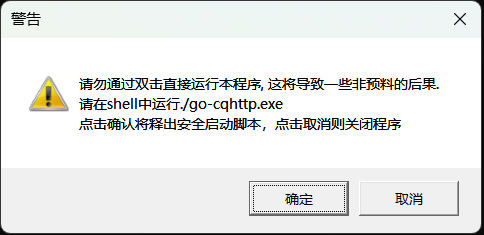
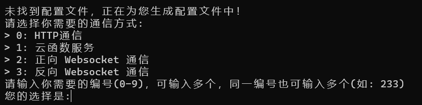
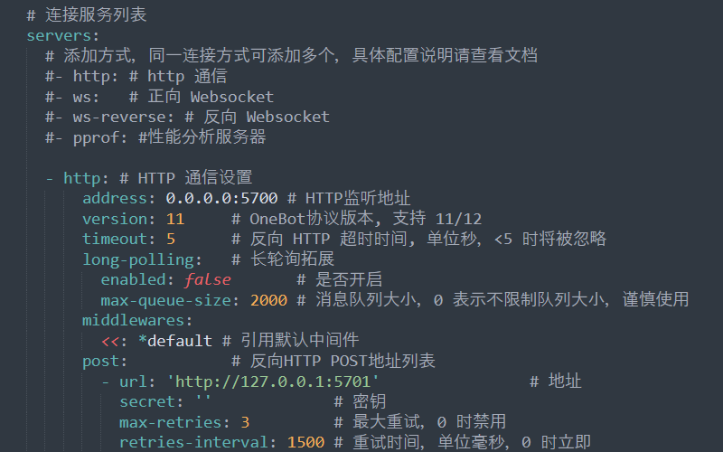

<p align="center">
  <a href="https://github.com/certainstar/little-Python-software/releases" target="_blank">
    
  </a>
</p>

<div align="center">

# 监听脚本

_基于 [Mirai](https://github.com/mamoe/mirai) , [MiraiGo](https://github.com/Mrs4s/MiraiGo) 的 [OneBot](https://github.com/howmanybots/onebot/blob/master/README.md) Go语言(易语言)实现的框架,部分java代码实现的签名服务器_

_主要框架为来自[Mrs4s大佬的go-cqhttp机器人框架](https://github.com/Mrs4s/go-cqhttp/)_

_签名服务器为来自[fuqiuluo大佬的服务器部署](https://github.com/fuqiuluo/unidbg-fetch-qsign)_

_脚本程序为Python语言编写,可在仓库中找到[各个版本的Python源代码](https://github.com/certainstar/little-Python-software/tree/%E7%89%88%E6%9C%AC%E6%9B%B4%E6%96%B0/%E7%9B%91%E5%90%AC%E8%84%9A%E6%9C%ACpython%E6%BA%90%E7%A0%81)，可自取。__请在合法条件下使用或修改源程序！__ 若没有Python编译器，可去[Python官网](https://www.python.org/)下载，或直接使用已经编译好的[exe文件](https://github.com/certainstar/little-Python-software/tree/%E7%89%88%E6%9C%AC%E6%9B%B4%E6%96%B0/%E7%9B%91%E5%90%AC%E8%84%9A%E6%9C%AC%E5%8F%AF%E6%89%A7%E8%A1%8C%E6%96%87%E4%BB%B6(.exe))_

</div>

<p align="center">
  <a href="https://www.apache.org/licenses/LICENSE-2.0" target="_blank">
    
  </a>
  <a href="https://github.com/certainstar/little-Python-software/releases" target="_blank">
    
  </a>
</p>

<p align="center">
  <a href="https://github.com/certainstar/little-Python-software/releases" target="_blank">下载</a>
</p>

# 使用教程

## 前置配置

### **1. 对go-cqhttp进行配置**
<details>
  <summary>如何配置go-cqhttp</summary>

  - 可进入[Mrs4s大佬的go-cqhttp项目库](https://github.com/Mrs4s/go-cqhttp/)，自行配置，其中[教学文档](https://docs.go-cqhttp.org)有[引导部分](https://docs.go-cqhttp.org/guide/#go-cqhttp)，可供学习参考。
  - 若不会配置可跟随下方步骤进行配置：
      <details>
        <summary>步骤如下</summary>

      - [x] 首先下载适合自己系统的最新的 _`go-cqhttp.exe`_ 文件，_[最新下载地址](https://github.com/Mrs4s/go-cqhttp/releases)_，或者直接导入[本库中的go-cqhttp.exe文件](https://github.com/certainstar/little-Python-software/blob/%E7%89%88%E6%9C%AC%E6%9B%B4%E6%96%B0/go-cqhttp/go-cqhttp.exe)，_`注意：本库中的go-cqhttp为amd64版本`_
      - [x] 下载后，点击 _`go-cqhttp.exe`_，会弹窗（如图配置go-cq步骤1），直接一路确认然后会在此目录下生成一个 _`go-cqhttp.bat`_ 文件，点击bat文件。
      <p align="center">
        
        <p align="center">
          <span> 配置go-cq步骤1</span>
        </p>
      </p>
      
      - [x] 此时会生成一个如下图所示的弹窗，可以按照自身需求输入0~3，本程序以输入0为例子。输入后回车会生成一个 _`config.yml`_ 文件，打开后可以进行修改（可用记事本方式打开）,这里推荐用Sublime Text软件进行查看。[点击此处进入懒人界面](https://certainstar.github.io/Github-Pages-Save/md/little-Python-software/onekey-yml)[^1]
      
      [^1]:进入懒人界面可直接复制完整版的 _`config.yml`_ 文件。

      <p align="center">
        
        <p align="center">
          <span>配置go-cq步骤2<span>
        </p>
      </p>
    
      - [x] 首先将QQ号和相对应的密码进行输入，_`输入密码时记得在引号中输入`_ 。后续将

        ```yaml
        # 是否允许发送临时会话消息
        allow-temp-session: false
        ```
        改为：
        ```yaml
        # 是否允许发送临时会话消息
        allow-temp-session: true 
        ```

        然后移到文件 __最后__ ，将 _`server`_ 中加入如下代码（___注意：缩进一定要准确，同时 `post` 中的`监听地址端口号`要为`5700`，`反向HTTP POST端口号`要为`5701`，因为程序中的`监听端口号`和`反向HTTP POST端口号`分别为`5700`和`5701`，但如果你想要监听其他端口或者由于端口`5700`和端口`5701`已经被占用，请将go-cqhttp中的端口和程序源码中的监听端口同步修改 ，若您使用的是`2.0.0`版本，则只需要在程序内部进行修改，保证与go-cqhttp中一致即可。___）：

        ```yaml
        - http: # HTTP 通信设置
          address: 0.0.0.0:5700 # HTTP监听地址
          version: 11     # OneBot协议版本, 支持 11/12
          timeout: 5      # 反向 HTTP 超时时间, 单位秒，<5 时将被忽略
          long-polling:   # 长轮询拓展
            enabled: false       # 是否开启
            max-queue-size: 2000 # 消息队列大小，0 表示不限制队列大小，谨慎使用
          middlewares:
            <<: *default # 引用默认中间件
          post:           # 反向HTTP POST地址列表
            - url: 'http://127.0.0.1:5701'                # 地址
              secret: ''             # 密钥
              max-retries: 3         # 最大重试，0 时禁用
              retries-interval: 1500 # 重试时间，单位毫秒，0 时立即
        ```

        修改后的 _`server`_ 部分如下图所示，可自行比对检查：
      <p align="center">
        
        <p align="center">
          <span>配置go-cq步骤3</span>
        </p>      
      </p>

      > ___注：如果不知道自己的端口是否被占用，[点击此处](https://certainstar.github.io/Github-Pages-Save/md/little-Python-software/listening)学习如何查看和怎么清理后台文件。___

      - [x] 此时保存 _`config.yml`_ 文件，再次点击 _`go-cqhttp.bat`_ 文件，此时会生成一个 _`device.json`_ 文件,此时观察弹窗中的信息，如果未遇到 _`code 45`_ 错误，或者并未警告，账号有较高风险，则推荐继续向下操作。
        <div id="nowarning">
          未有报错或警告时，弹窗中会有以下信息（如图配置go-cq步骤4所示）
          
          <p align="center">
            
            <p align="center">
              <span>配置go-cq步骤4</span>
            </p>
          </p>

          推荐输入1后回车，这时弹窗会显示 _`请前往该地址验证->网址`_，将网址复制到浏览器打开，完成滑条验证后关闭，若此时弹窗无报错，可能会出现类似以下信息：
          ```
          该QQ有设置密保:
          1.给手机***...***发送消息
          2.手机QQ扫码验证
          ```
          可自行选择1或2后回车，按照相对应的流程完成验证后，一般会正常登录。

          _若出现在滑条验证中输入`1.自动提交`时，验证网址一直加载不出来的情况（最近出现较多），请选择`2.手动抓取提交`，如果不知道怎么手动抓取，[点击此处](https://certainstar.github.io/Github-Pages-Save/md/little-Python-software/Manually-capture)进行学习_

          若刚开始或完成滑块验证后有风险或遇到 _`code 45`_ 错误，请<a href="#qsign">配置签名服务器</a>，并对相应的 _`config.yml`_ 文件进行修改。
        </div>
      </details>      
</details>

### **2. 对签名服务器进行配置**
<details>
<summary id="qsign">如何配置签名服务器</summary>

> ___提醒：运行该签名服务器前需要配置`java环境`，所以若还未配置java环境可先去[java官网](https://www.java.com/)进行下载，然后进行配置（若java版本过低无法运行后续bat脚本，可直接利用java命令进行更新），如果不会配置，[请点击此处进入配置java环境教学部分](https://certainstar.github.io/Github-Pages-Save/md/little-Python-software/java-config)___

> _问题：为什么要用签名服务器？为减少风控，减少`code45`  风控报错，最好对签名服务器进行配置_
  
  - 可进入[fuqiuluo大佬的签名服务器项目](https://github.com/fuqiuluo/unidbg-fetch-qsign)，并进行部署。或者更快捷的参考[rhwong大佬的一键部署项目](https://github.com/rhwong/unidbg-fetch-qsign-onekey)，并进行部署。
  - 若不会配置可跟随下方步骤进行配置：
      <details>
        <summary>步骤如下</summary>

      - [x] 首先查看目前 _`go-cqhttp.exe`_ 支持的签名服务器版本号(应该是向下兼容的)，然后在[大佬的签名服务器项目下载页面](https://github.com/fuqiuluo/unidbg-fetch-qsign/releases)进行下载自己想要的版本。或者直接下载本项目中已经[下载好的签名服务器](https://github.com/certainstar/little-Python-software/tree/%E7%89%88%E6%9C%AC%E6%9B%B4%E6%96%B0/%E7%AD%BE%E5%90%8D%E6%9C%8D%E5%8A%A1%E5%99%A8)。 _`注意：本库中的签名服务器版本为1.1.0版本`_（若下载本库中的请直接将本库的 _`签名服务器`_ 文件夹下载完全，其中包三个文件夹：_`bin`_ , _`lib`_ , _`txlib`_ 和一个 _`start.bat`_ 文件）
      - [x] 下载后打开会发现有一个 _`start.bat`_ 脚本（如果在大佬的项目中没有找到，可以自行编写，源码可查看本项目中的 [_`start.bat脚本源代码`_](https://github.com/certainstar/little-Python-software/blob/%E7%89%88%E6%9C%AC%E6%9B%B4%E6%96%B0/%E7%AD%BE%E5%90%8D%E6%9C%8D%E5%8A%A1%E5%99%A8/start.bat) ）或直接复制以下代码：
        ```bat
        bin\unidbg-fetch-qsign.bat --library=txlib\8.9.63 --port=8080  --count=1 --android_id= --host=0.0.0.0
        ```
      - [x] 打开 _`start.bat`_ 文件进行编辑（可用记事本方式打开），会发现 _`android_id`_ 变量还未填入，此时返回找到在配置go-cqhttp时产生的 _`device.json`_ 文，打开该文件，找到该文件中的 _`android_id`_ 变量，复制变量值后（_只复制引号中的值_），粘贴到 _`start.bat`_ 文件中的 _`android_id=`_ 后进行赋值( _赋值后`--host`部分与你所复制的值之间应该有一个空格_)，赋值后代码应该形如：
        ```bat
        bin\unidbg-fetch-qsign.bat --library=txlib\8.9.63 --port=8080  --count=1 --android_id=xxxx...xxxx --host=0.0.0.0
        ```
        __此处还有一个重点就是 _`library`_ 变量的值，此处代表QQ的协议值，只用关心 _`8.9.63`_ 这个值 ，看其是否与打开 _`go-cqhttp.bat`_ 时,系统弹窗上显示的使用协议是否一致__

        __例如打开_`go-cqhttp.bat`_ 后出现以下提示：__
        ```cmd
        [INFO]: 使用协议: Android Pad 8.9.63.11390
        ```
        说明使用协议为 _`8.9.63`_ 版本，与 _`library`_ 变量的值一致，若不一致，则需要修改 _`library`_ 变量的值与go-cqhttp版本中一致。

        保存点击 _`start.bat`_ 文件，打开后如果有系统弹窗运行且没有显示有问题，就说明签名服务器配置成功(另一方面，也可以通过查看go-cqhttp中是否显示签名服务器有问题来判断是否配置成功)。
        一般若运行成功会在最后一行出现以下代码：
        ```bat
        [FEKit_]info: task_handle.h:74 TaskSystem not allow
        ```
        此时返回找到配置go-cqhttp时生成的 _`config.yml`_ 文件，打开将签名服务器填入，即将代码
        ```yaml
        # 服务器可使用docker在本地搭建或者使用他人开放的服务
        sign-server: '-'
        ```
        修改为：
        ```yaml
        # 服务器可使用docker在本地搭建或者使用他人开放的服务
        sign-server: 'http://localhost:8080'
        ```
        或者修改为：
        ```yaml
        # 服务器可使用docker在本地搭建或者使用他人开放的服务
        sign-server: 'http://127.0.0.1:8080'
        ```
        保存 _`config.yml`_ 后打开 _`go-cqhttp.bat`_ 脚本（此时要保证 _`start.bat`_ 脚本生成的签名服务器在后台运行，即生成的系统弹窗未关闭）。后续按照上述<a href="#nowarning" >未有报错或警告时</a>的操作进行操作。

        由于部分原因，可能在第一次正常登录后，后续登录就不需要再挂上签名服务器，直接点击 _`go-cqhttp.bat`_ 脚本进行启动即可。若不放心，认为还有封号风险，可以在后续登录时先启动 _`start.bat`_ 脚本然后再启动 _`go-cqhttp.bat`_ 脚本。
      </details>  
</details>

### **3.检查go-cqhttp是否按要求运行**

- [x] 如果go-cqhttp正常运行，则会出现以下提示：
    ```cmd
        [INFO]: 正在检查协议更新...
        [INFO]: 登录成功 欢迎使用: 您的QQ昵称
        [INFO]: 开始加载好友列表...
        [INFO]: 共加载 *** 个好友.
        [INFO]: 开始加载群列表...
        [INFO]: 共加载 *** 个群.
        [INFO]: 资源初始化完成, 开始处理信息.
        [INFO]: アトリは、高性能ですから!
        [INFO]: HTTP POST上报器已启动: http://127.0.0.1:5701/  (此处应该是config.yml文件中您配置的反向HTTP POST监听端口号)
        [INFO]: CQ HTTP 服务器已启动: [::]:5700  (此处应该是config.yml文件中您配置的HTTP监听地址端口号)
        [INFO]: 正在检查更新.
        [INFO]: 检查更新完成. 当前已运行最新版本.
        [INFO]: 开始诊断网络情况
        [INFO]: 收到服务器地址更新通知, 将在下一次重连时应用.
        [INFO]: 网络诊断完成. 未发现问题
   ```
   > 若未正常运行，则不会有此提示。常见错误见<a href="#error">常见go-cqhttp报错以及处理方式</a>

- [x] 如果程序出现上述提示后正常运行时，出现类似以下警告，是正常现象，不用担心。
```cmd
     [WARNING]: 上报 Event 数据到 http://127.0.0.1:5701(您配置的反向HTTP POST端口号)/ 失败: Post "http://127.0.0.1:5701/": dial tcp 127.0.0.1:5701: connectex: No connection could be made because the target machine actively refused it. 将进行第 n 次重试
```

- [x] 第一次正常登录后，会生成一个 _`session.token`_ 文件，可以通过此，来判断是否正常登录。

### **4.常见go-cqhttp报错以及处理方式**
<span id="error"></span>

1. _signsever报错_：说明签名服务器配置有问题，建议检查签名服务器的配置过程是否正确，并且请查看您的签名服务器是否在后台正常运行。

2. _在几次正常登录后，又提醒类似 `您的账号被风控` 的字眼_：大概率说明账号被封号了，直接 `进行解封就可以`。

3. _若出现正常登录时的提示，但是中间有类似`5700(您在config.yml文件配置的两个端口)被占用，将在5秒内关闭bot`的字眼_：说明您的端口被占用，解决方式请见[如何查看端口状态和清理端口工作问题](https://certainstar.github.io/Github-Pages-Save/md/little-Python-software/listening)。 
请将config.yml文件中您配置的端口换成未被占用的端口，并将程序中的两个对应监控端口位置进行修改，您可以通过修改py文件源码实现此修改(若您使用2.0.0版本程序，可以直接在程序内部进行修改)。`注意：一定要使程序监听端口一定要与`config.yml`文件中一致，否则程序会无响应。`

## 程序使用

>___提醒：在使用程序前，请查看前置配置是否完成，同时注意保证在使用该程序时，您的QQ已经在go-cqhttp上登录___

>___再次提醒：程序监听端口一定要与`config.yml`文件中一致，否则程序会无响应___

- 本程序在 _`1.1.0`_ 版本后，需要安装在 _有权限更改文件的目录_ 下，如果程序打不开，请使用管理员模式打开exe程序。

- 打开程序后会在同目录下生成一个 _`user_data`_ 文件夹（版本 _`1.0.0`_ 不会生成），为正常现象，若未生成说明程序未正常打开，请用 _管理员模式_ 运行。

- 请根据程序的使用帮助界面，进行合法化合理化使用。

## 关于程序中常见的问题

1. ___若程序在您输入相应要求后，只进行监控并在监控区有文本显示，而不发送消息，说明您的反向HTTP POST端口没有问题，而HTTP监控端口被占用___ 。为进一步确定是否为该问题，您可以将go-cqhttp挂在后台运行，然后点击浏览器输入网址 `127.0.0.1:(config.yml文件中您填入的HTTP监控端口)/send_msg?message_type=private&user_id=某个好友的QQ&message=测试成功`， 如果没有成功给您的好友发送消息“测试成功”，则说明存在该问题，此时建议将当前HTTP监控端口更换未被占用的端口(`注意：修改时，两个端口在程序和go-cqhttp中要一致。`)。若成功发送，且不知道如何解决，可联系开发者或者直接进行提问。

2. ___若程序在您输入相应要求后，没有进行监控并在监控区没有文本显示，同时也不发送消息，说明您的反向HTTP POST端口有问题___，同上进行更换。

3. ___若程序在第一次正常运行，而后续再次启用时，无法正常使用功能，大概率是因为您没有关闭完全程序的后台运行，解决此问题请查看[如何查看端口状态和清理端口工作问题](https://certainstar.github.io/Github-Pages-Save/md/little-Python-software/listening)___，若无法解决，~~可尝试重启电脑或者更换最新版本程序。若实在不知道该如何进行，可联系开发者或者直接进行提问。~~

> _如有其他问题,请联系开发者或直接进行提问。_

# 关于程序的更新日志

<details>
    <summary>详细情况点击查看</summary>

### 关于版本1.0.0

- 为程序的第一版，只是实现了最初监控某个特定QQ群中包含某些关键词的功能。

### 关于版本1.1.0

- 在第一版基础上，新增一个监控窗口并显示监控内容。

### 关于版本1.2.1（~~此版本由于有大量bug不建议使用~~）

- 在上一版基础上，对关闭程序后flask线程仍然要手动关闭的问题进行修复，并添加一个安全退出按键和终止监控功能，同时为了更加清晰是否检测到关键词，将接受消息中的关键词进行标红处理。

### 关于版本2.0.0

- 当前最新版本，应该在未来很长时间不会新增功能和优化，只会修改部分反馈bug。

- 修复了 _部分导致程序异常崩溃的问题（不填入群聊或其他消息直接点击开始监控导致的程序崩溃，正常运行后点停止监控再点击安全退出导致的程序崩溃）_ 。

- _相对版本1.X.X升级页面。_

- __有人在群聊中发送其他消息时，消息无法显示，而显示乱码的问题进行优化。__

-  ___新增`定时功能`，`选择“检测关键词并发消息”次数的功能`,`修改监控对象和发送对象功能`（其他新加功能在使用过程中可以发现）。在另一方面，为了优化关键词的选择，不那么单调，新增了“或和并”选择关键词方法。___

</details>

# 关于程序的某些说明

- 程序的源码部分可以自行获取，但请在 ___`合法合理情况`___ 下使用。

- 本程序源码以及衍生产物 ___不允许在权限未授予的情况下`商业化`使用___ ，否则根据本项目的[license:Apache License 2.0](https://www.apache.org/licenses/LICENSE-2.0)，可以 __侵犯权益__ 的名义上诉。

- 由于本程序的某些特殊性质，可能会在 ___`未来某时停更或者删除本项目`___ ，还请大家见谅。

- 但是也不必太过于严肃，程序设计初衷也是为了方便大家，希望大家在使用程序时获取便利，最后，___just enjoy yourself now！___

# 免责声明

- 关于程序会导致 _`QQ封号`_ 的问题，在此进行解释，本程序不会导致封号，导致封号的原因在于QQ对QQ机器人框架的异常状态处理，但这不证明程序(本程序，go-cqhttp，签名服务器)代码有问题，只是问题产生在于 _`QQ的风控检测上`_ ，QQ封号一般为短期封号，可以直接进行解冻。在此声明： ___QQ封号与本程序和提供的一切服务均没有关系，故您在使用本程序时，造成QQ封号，本人不会承担任何责任与赔偿！___

- 对于本程序中需要使用的签名服务器，如果是公用API，那么可能会导致以下问题，~~如果您自建服务器失败，还是建议您 _尽量少使用_ 公共服务器。~~

> 使用他人搭建的服务器会导致部分信息泄露（如下）

> | 可能会泄露以下信息          | 不会泄露的信息: |
> | --------------------------- | --------------- |
> | 登录账号                    | 账号密码        |
> | 登录时间                    | 账号 `session`  |
> | 登录后发送的消息内容        | 群列表/好友列表 |
> | 登录后发送消息的群号/好友ID | 接收的消息      |
> |  | 除发送消息外的任何历史记录      |

___`注：本程序（不包括本项目所使用的go-cqhttp和签名服务器）并不会泄露您的任何信息!`___

# Issue

- 本项目由于 ___特殊原因（开发者只有一个，而且`很懒`）___ ，所以并没有开启（还有一个原因，开发者并非长期关注github的用户），所以提交bug或者想要新功能，在[release](https://github.com/certainstar/little-Python-software/releases)处留言或者直接
<a href="mailto:2378145658@qq.com">email me at 开发者的邮箱</a>(2378145658@qq.com)，开发者会定时查看大家的反馈。
